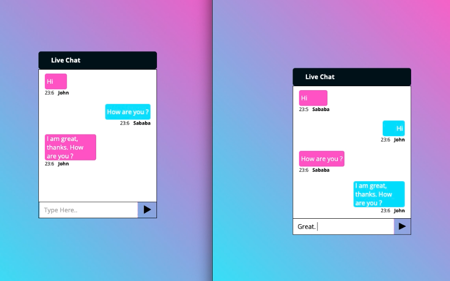

# ChatterX


A real-time chat application built with Node.js, React.js, and Socket.io. This app allows users to chat instantly across different devices and browsers. In the walkthrough video, using the same device, I have tested it with two users: **User 1 (Sababa)** on Chrome and **User 2 (John)** on Safari. You can also try it using an incognito window to simulate different users.




## Features:

- Real-time messaging using Socket.io.
- User-friendly interface built with React.js.
- Cross-browser compatibility (Chrome, Safari, etc.).
- Instant updates for new messages without needing to refresh.
- Testable on the same device using multiple browser tabs or incognito windows.

## Technologies Used:

- **Node.js**: Backend server to handle connections and events.
- **React.js**: Frontend to build the user interface.
- **Socket.io**: Real-time, bi-directional communication between the client and server.
- **CSS**: For styling the app.

## Installation:

1. Clone the repository to your local machine:
   ```
   git clone 
   cd Real-Time-React-Chat-App
   ```
   
2. Install the required dependencies for both backend and frontend:

-For the backend (Node.js):
```
cd server
npm install
```

-For the frontend (React.js):
```
cd client
npm install
```

## Run the application:

1.Start the backend server:
```
cd server
npm start
```
2.Start the frontend:
```
cd client
npm start
```
The app will be running on http://localhost:3000 by default.

## How to Test:

-Open User 1 (Sababa) on Chrome.

-Open User 2 (John) on Safari (or use a different browser to simulate a second user).

-You can also test with incognito windows or on different devices.

-Start chatting between the two users. Messages will appear in real-time without needing to refresh.

## View The Walkthrough Video Here:

[](https://youtu.be/p5ZnppCVRsI)


## License:

This project is licensed under the MIT License - see the LICENSE file for details.

